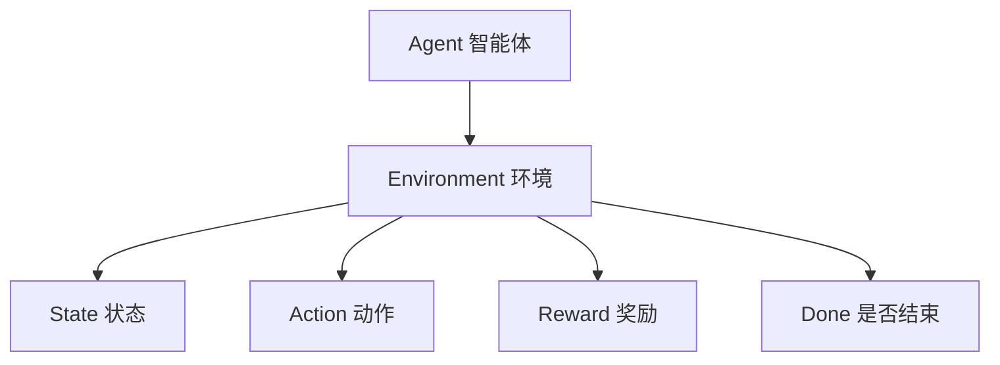

---

# 🧊 FrozenLake 环境文档（强化学习）

## 一、概述（Overview）

**FrozenLake** 是一个经典的强化学习环境，模拟智能体（Agent）在冰冻湖面上导航的过程。其主要挑战是：

* 在滑动冰面上控制动作方向
* 避免掉入冰洞（Holes）
* 安全到达目标（Goal）

### ✅ 环境特点

| 特性      | 描述                |
| ------- | ----------------- |
| 🔄 随机滑动 | 冰面有滑动特性，导致动作结果不确定 |
| ⚠️ 危险惩罚 | 掉入冰洞立即失败，无奖励（0）   |
| 🎯 成功目标 | 成功到达目标位置获得奖励 +1   |
| 🔁 多样地图 | 支持 4×4、8×8 或自定义地图 |

---

## 二、技术架构（Architecture）

### 1. 环境交互流程



### 2. 环境组件结构

* **状态空间（State Space）**：离散格点，共 $N = rows \times cols$ 个状态
* **动作空间（Action Space）**：4个方向：

  ```
  0: → 右移     (0, +1)
  1: ↓ 下移     (+1, 0)
  2: ← 左移     (0, -1)
  3: ↑ 上移     (-1, 0)
  ```
* **奖励系统（Reward System）**：稀疏奖励，只有终点为 +1，其余为 0。
* **终止条件（Terminal Conditions）**：

  * 掉入冰洞：失败
  * 到达目标：成功

---

## 三、地图构成（Map Elements）

| 字符 | 含义 | 显示颜色 |
| -- | -- | ---- |
| S  | 起点 | 浅绿色  |
| F  | 冰面 | 白色   |
| H  | 冰洞 | 红色   |
| G  | 目标 | 绿色   |

---

## 四、环境核心类（Core Class）

```python
class FrozenLakeEnv(gym.Env):
    def __init__(self, desc=None, map_name="4x4", is_slippery=True)
    def reset(self) -> int
    def step(self, action: int) -> Tuple[int, float, bool, dict]
    def render(self, mode: str = "human") -> Any
    def close(self)
```

---

## 五、安装与依赖（Installation）

### ✅ 系统要求

* Python ≥ 3.7
* 推荐使用虚拟环境

### ✅ 依赖库

```bash
pip install gym pygame numpy
```

---

## 六、使用指南（Usage Guide）

### 1. 创建环境

```python
from frozen_lake import FrozenLakeEnv

# 标准 4x4 地图
env = FrozenLakeEnv(map_name="4x4")

# 8x8 地图（含滑动特性）
env = FrozenLakeEnv(map_name="8x8", is_slippery=True)

# 自定义地图
custom_map = [
    "SFFH",
    "FHFH",
    "FFFH",
    "HFFG"
]
env = FrozenLakeEnv(desc=custom_map)
```

---

### 2. 运行周期示例

```python
def run_episode(env, max_steps=100):
    """运行一轮训练周期"""
    state = env.reset()
    total_reward, step_count = 0, 0
    done = False
    
    while not done and step_count < max_steps:
        action = env.action_space.sample()  # 随机动作
        next_state, reward, done, _ = env.step(action)
        env.render(mode="human")
        total_reward += reward
        step_count += 1
    
    return total_reward, step_count
```

---

### 3. 多轮训练

```python
env = FrozenLakeEnv(map_name="8x8", is_slippery=True)

num_episodes = 10
success_count = total_steps = 0

for i in range(num_episodes):
    reward, steps = run_episode(env)
    success_count += int(reward > 0)
    total_steps += steps
    print(f"第 {i+1} 轮: 奖励={reward}, 步数={steps}")

print(f"\n成功次数: {success_count}/{num_episodes}")
print(f"平均步数: {total_steps/num_episodes:.2f}")
env.close()
```

---

## 七、渲染系统（Rendering Modes）

| 模式 | 参数值          | 输出形式           |
| -- | ------------ | -------------- |
| 文本 | "ansi"       | 控制台文本地图        |
| 图形 | "human"      | 使用 Pygame 窗口显示 |
| 图像 | "rgb\_array" | 返回 RGB 数组      |

### ⚙️ 渲染参数

* 帧率（FPS）: `metadata["render_fps"]`
* 单元格大小: `cell_size = 60`
* 颜色字典: `self.colors`

---

## 八、高级功能（Advanced Features）

### ✅ 自定义地图尺寸

```python
custom_map = [
    "SFFFFH",
    "FFHFHF",
    "FHHFFH",
    "HFFFFG"
]
env = FrozenLakeEnv(desc=custom_map)
```

### ✅ 关闭滑动效果（确定性移动）

```python
env = FrozenLakeEnv(is_slippery=False)
```

### ✅ 获取当前智能体位置

```python
row = env.state // env.ncol
col = env.state % env.ncol
```

---

## 九、常见问题（FAQ）

### ❌ Pygame 窗口不显示

* 检查图形界面支持
* 验证安装：`python -m pygame --version`
* 退回文本模式：`env.render(mode="ansi")`

### ⚠️ 动作无效

* 动作值需为 0\~3
* 环境是否已终止
* 滑动模式存在随机性

### 🔁 状态转移边界处理

* 边界不越界（原位不动）
* 掉入冰洞立即终止
* 到达目标即终止

---

## 🔬 十、应用场景（Use Cases）

### 🎓 教学演示

* 强化学习三元组：状态-动作-奖励
* 策略比较（如 Q-learning vs 随机策略）
* 演示探索-利用的折中权衡

### ⚙️ 算法开发

* 动作控制策略设计
* 稀疏奖励优化策略
* 基准算法测试平台

### 🔍 扩展研究

* 添加风力或天气动态
* 多智能体协作导航
* 部分可观测状态（POMDP）扩展

---

## 📄 许可证（License）

本项目基于 **MIT License** 授权，允许自由使用、修改和分发。详情参见 LICENSE 文件。

---